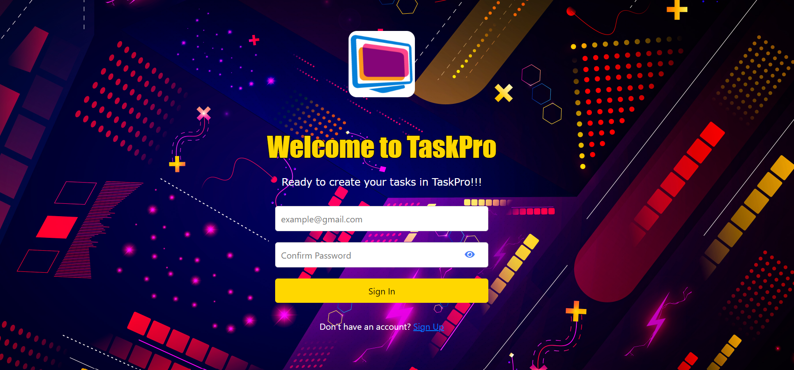

<link rel="stylesheet" href="https://cdnjs.cloudflare.com/ajax/libs/font-awesome/5.15.3/css/all.min.css">

 

  
  <h3 align="center">Final Project TaskPro App</h3>
  <a href="https://proyecto-final-emiand.vercel.app/auth/login">Visit Website</a>

  
Table of Contents

  <ol>
    <li>
      <a href="#introduction">Introduction</a>
    </li>
     <li>
      <a href="#description">Description</a>
    </li>
    <li>
    <a href="#roadmap">Roadmap</a>
    </li>
      <li>
    <a href="#technologies">Technologies</a>
    </li>
       <li>
    <a href="#features">Features</a>
    </li>
    <li>
    <a href="#contributors">Contributors</a>
    </li>
     <li>
    <a href="#buildProcess">Build Process</a>
    </li>
         <li>
    <a href="#acknowledgments">Acknowledgments</a>
    </li>
    <li>
    <a href="#aboutme">About me</a>
    </li>
  </ol>
  

<h2> Introduction </h2>

With TaskPro, we aim to get a centralized space to create, edit and manage all your tasks, whether they are pending, in progress or completed.

<h2> Description </h2>

This is the final project developed during the Front-End Development bootcamp at Ironhack. It consists of a Vue.js based web application that allows users to manage their tasks. 

The application provides functionalities such as user account registration, task creation, editing existing tasks, marking tasks complete, and deleting tasks. To store all user and task data, the application is linked to a database. In this case, Supabase is used, a service that offers a set of Back-End functionalities for database management. 

 __The main__ objective of this project is to put into practice the knowledge acquired in Vue.js during the course, as well as establish the connection with an external database and manage it effectively. 

(<a href="#readme-top">back to top</a>)

<h2> Roadmap </h2>

 <h3>Sabado 01/07/23</h3>

 - Preparar el README con la descripcion del proyecto y el roadmap ✅   
 - Subir el proyecto a Vercel para que este disponible para todo el mundo ✅   
 - Conectar el proyecto con supabase para almacenar los datos de la app ✅   

 <h3>Martes 03/07/23</h3>

 - Implementar HTML y CSS del Sign Up y Sing In ✅   
 - Implementar la logica para el Sign Up, Sign In y Sing Out ✅   
 - Implementar la funcion de ocultar/mostrar contraseña a la hora de hacer Sign In y Sing Up ✅   

 <h3>Miercoles 05/07/23</h3>

 - Añadir funcionalidad al boton update para editar titulo y descripción de la tarea  ✅  
 - Preparar la tienda task.js para poder conectar los botones con la base de datos ✅  
 - Implementar funcionalidad de la fecha en el home ✅  

 
(<a href="#readme-top">back to top</a>)

 <h3>Jueves 06/07/23</h3>

 - Hacer el fetch de las tareas de Supabase al cargar la pagina y cada vez que se ejecute alguna accion de cambio ✅  
 - Implementar la funcionalidad de alerta cuando se borre alguna tarea con Sweetalert2 ✅  
 - Cuando el usuario clique en el boton de toggle y cambie el estado de la tarea a "Completada", esta se tacha ✅  

 <h3>Viernes 07/07/23</h3>

 - Implementar menu hamburguesa para versiones moviles ✅ 
 - Adaptar el diseño a la version movil ✅ 

 <h3>Sabado 08/07/23</h3>

 - Implementar formulario para los perfiles de usuario ✅  
 - Implementar funciones para almacenar los datos de perfil de usuario ✅  
 - Añadir el diseño CSS del View Account ✅ 
 
 
(<a href="#readme-top">back to top</a>)

 <h3>Lunes 10/07/23</h3>

 - Implementar el footer ✅  

 <h3>Sabado 15/07/23</h3>

 - Terminar con el diseño CSS de todos los componentes  ✅   
 

 <h3>Lunes 17/07/23</h3>

 - Repaso general de la app y detalles ✅  

 <h3>Martes 18/07/23</h3>
 
 - Añadir ultimos detalles Readme ✅  
 - Repaso a la App y todas sus funcionalidades ✅  
 

 <h3>Miercoles 19/07/23</h3>
 
 - Añadir ultimos detalles Readme ✅  
 - Repaso a la App y todas sus funcionalidades ✅  

 <h3>Jueves 20/07/23</h3>

 - Seguir probando la funcionabilidad de la app ✅  

  
(<a href="#readme-top">back to top</a>)

<h3>Lunes 24/07/23</h3>

- EXTRAS
- Implementar el About con card-flip y datos DEV ✅  
- Implementar loading en el componente Account para evitar delay de supabase ✅  
- Implementar ModoClaro "EXTRA" en el componente Home ✅  

<h3>Martes 25/07/23</h3>

- Ultimos detalles app  
- Preparar presentación del proyecto  

<h2>Technologies</h2>

 __Client:__ Vue.js y Vite 
 __Router:__ Vue Router 
 __Store:__ Pinia 
 __Database:__ Supabase 

(<a href="#readme-top">back to top</a>)

<h2>Features</h2>

 Discover the key functions of  __Taskpro:__ 

 - Maintain order in your daily life with TaskPro. 
 - Register and create your own account in TaskPro. 
 - Manage all your tasks efficiently. 
 - Edit and delete: Customize your tasks according to your needs. 

With TaskPro, you will have a simple and effective tool to manage your tasks in a practical way. 

(<a href="#readme-top">back to top</a>)

<h2>Contributors</h2>

I am sincerely grateful for the exceptional collaboration and teamwork we have experienced. From the bottom of my heart, thank you all for being an invaluable part of this project!

<table>
  <tr>
    <td align="center">
      <a href="https://github.com/FacundoDM-dev">
        
         
        Facundo del Medico
      </a>
    </td>
    <td align="center">
      <a href="https://github.com/nicodalessandro11">
        
         
        Nicolas D'Alessandro
      </a>
    </td>
   <td align="center">
      <a href="https://github.com/gabrielberarducci">
        
         
       Gabriel Berarducci
      </a>
    </td>
  </tr>
</table>

<h2>Build Process</h2>

<ol>
<li>I set up my project using Vite, which is a fast and efficient development tool for Vue.js based web applications. I installed Vue.js, Vue Router and Pinia as my project dependencies using npm or yarn. I organized the basic structure of the project, including the folders for the components, the paths and the Pinia store.</li>
 
<li>For the UI, I designed and built the necessary Vue components for my task app. I used Vue Router to define the routes and views corresponding to the different sections of my application. I've implemented navigation between views using the features provided by Vue Router, such as <router-link> and <router-view> .
</li>
 
<li>For data storage, I set up the Pinia store to manage my application state related to tasks. I defined the necessary modules in the Pinia store to store and manipulate my task data, such as the task list and its completion status.
</li>
 
<li>I integrated my app with Supabase, a backend platform as a service. I have configured the connection to Supabase using the Supabase client in my project. I used the functions provided by the Supabase client to perform CRUD operations on the Supabase database. I've implemented the necessary logic in my Pinia actions to interact with Supabase and keep my task data in sync between the database and my application.
</li>
 
<li>I've implemented additional functionality in my task app, providing a way to edit existing tasks, update their status, and delete them. I used the functions and actions of the Pinia store to perform these actions and maintain the state of the tasks in a reactive way. Also, I updated the UI to reflect the changes made to the tasks.
</li>
 
<li> I've implemented a user profile form that allows me to upload an avatar image. I used Supabase to handle updating the profile data, including the avatar image URL. While editing the profile and selecting a new avatar image, I uploaded the image using Supabase Storage. Then I updated my profile data in the Supabase database, including the new avatar image URL. The user interface is automatically updated to show the changes made.
</li>
 
<li>I have implemented a clock component in another link in my app to display the current date and time in real time. This makes it easy to edit and manage tasks by providing an accurate reference to the current date and time. In addition, the automatic update capability of the clock improves the user experience by keeping the information always up-to-date without the need for manual reloads.</li>
 
</ol>

<h2> 💚️Acknowledgments💚️</h2>

<table>
  <tr>
    <td align="center">
        
         
        Amazon
      </a>
    </td>
    <td align="center">
     <a href="https://www.ironhack.com/es/es">
        
         
        Ironhack
      </a>
    </td>
     <td align="center">
     <a href="https://github.com/dzc1">
        
         
        Diego Zito
      </a>
    </td>
  <td align="center">
      <a href="https://github.com/FacundoDM-dev">
        
         
        Facundo del Medico
      </a>
    </td>
    <td align="center">
      <a href="https://github.com/nicodalessandro11">
        
         
        Nicolas D'Alessandro
      </a>
    </td>
    <td align="center">
      <a href="https://github.com/gabrielberarducci">
        
         
        Gabriel Berarducci
      </a>
    </td>
  </tr>
</table>

I am pleased to express my sincere thanks to __Amazon__ for providing me with this invaluable opportunity to learn and grow in the field of Front-End development. Through your support and resources, I have been privileged to acquire knowledge and skills that have enriched my professional career.

In addition, I want to extend my gratitude to __Ironhack__, a leading educational institution in the technological arena. Thanks to your training program, I have received a quality education and a solid foundation in web development. __Ironhack__ has been instrumental in my ability to advance in this exciting career.

I cannot fail to mention my special thanks to Professor __Diego Zito__, whose experience and dedication have been invaluable in my learning journey. His expert guidance, patience, and constant motivation have helped me overcome challenges and reach new levels of excellence.

Last but not least, I want to thank my classmates, __Facu__, __Gabi__ and __Nico__ in particular. Your support, collaboration and camaraderie have made this experience even more enriching. Together we have shared knowledge, overcome obstacles and celebrated achievements, creating an invaluable network of learning and friendship.

In short, I am deeply grateful to _Amazon_, _Ironhack_, Professor _Diego Zito_, and my _classmates_ for their significant contribution to my professional and personal development. These experiences and connections have propelled me forward and provided me with a solid foundation to continue growing in the exciting field of Front-End development.

(<a href="#readme-top">back to top</a>)

<h2>⚜️About me⚜️</h2>

My name is Emilio Carrasco, I am 36 years old, I am a junior web developer and I have been passionate about this world since day one that I started this adventure almost two years ago, every day I learn something new and there is a phrase that I want to share with you Never Master Always Student, being humble and hardworking is a characteristic that defines me.

I hope I can help you in everything I can, if you have any problem with the project or I can help you with something my email will be right below, thanks... and see you soon...

<table>
  <tr>
    <td align="center">
      <a href="https://github.com/Emiand13">
        
         
        Emiand13
      </a>
    </td>
  </tr>
</table>

⚜️life is for the living⚜️

Emilio Carrasco - 13emiand@gmail.com

(<a href="#readme-top">back to top</a>)

