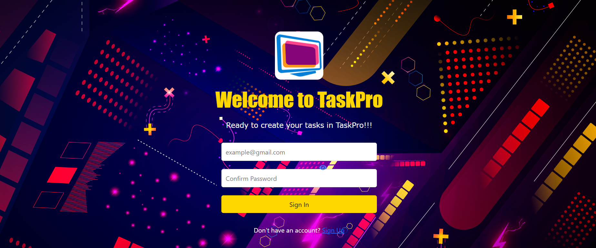

<link rel="stylesheet" href="https://cdnjs.cloudflare.com/ajax/libs/font-awesome/5.15.3/css/all.min.css">

 

  
  <h3 align="center">Final Project TaskPro App</h3>
  <a href="https://proyecto-final-emiand.vercel.app/auth/login">Visit Website</a>

  
Table of Contents

  <ol>
    <li>
      <a href="#Introduction">Introduction</a>
    </li>
     <li>
      <a href="#Description">Description</a>
    </li>
    <li>
    <a href="#Roadmap">Roadmap</a>
    </li>
      <li>
    <a href="#Technologies">Technologies</a>
    </li>
       <li>
    <a href="#Features">Features</a>
    </li>
    <li>
    <a href="#Contributors">Contributors</a>
    </li>
     <li>
    <a href="#Build Process">Build Process</a>
    </li>
         <li>
    <a href="#Acknowledgments">Acknowledgments</a>
    </li>
  </ol>
  

<h2> Introduction </h2>

With TaskPro, we aim to get a centralized space to create, edit and manage all your tasks, whether they are pending, in progress or completed.

<h2> Description </h2>

This is the final project developed during the Front-End Development bootcamp at Ironhack. It consists of a Vue.js based web application that allows users to manage their tasks. 

The application provides functionalities such as user account registration, task creation, editing existing tasks, marking tasks complete, and deleting tasks. To store all user and task data, the application is linked to a database. In this case, Supabase is used, a service that offers a set of Back-End functionalities for database management. 

 __The main__ objective of this project is to put into practice the knowledge acquired in Vue.js during the course, as well as establish the connection with an external database and manage it effectively. 

(<a href="#readme-top">back to top</a>)

<h2> Roadmap </h2>

 <h3>Sabado 01/07/23</h3>

 - Preparar el README con la descripcion del proyecto y el roadmap ✅   
 - Subir el proyecto a Vercel para que este disponible para todo el mundo ✅   
 - Conectar el proyecto con supabase para almacenar los datos de la app ✅   

 <h3>Martes 03/07/23</h3>

 - Implentar HTML y CSS del Sign Up y Sing In ✅   
 - Implentar la logica para el Sign Up, Sign In y Sing Out ✅   
 - Implementar la funcion de ocultar/mostrar contraseña a la hora de hacer Sign In y Sing Out ✅   

 <h3>Miercoles 05/07/23</h3>

 - Añadir funcionalidad al boton update para editar titulo y descripción de la tarea  ✅  
 - Preparar la tienda task.js para poder conectar los botones con la base de datos ✅  
 - Implementar funcionalidad de la fecha en el home ✅  

 
(<a href="#readme-top">back to top</a>)

 <h3>Jueves 06/07/23</h3>

 - Hacer el fetch de las tareas de Supabase al cargar la pagina y cada vez que se ejecute alguna accion de cambio ✅  
 - Implementar la funcionalidad de alerta cuando se borre alguna tarea con Sweetalert2 ✅  
 - Cuando el usuario clique en el boton de toggle y cambie el estado de la tarea a "Completada", esta se tacha ✅  

 <h3>Viernes 07/07/23</h3>

 - Implementar menu hamburguesa para versiones moviles 
 - Adaptar el diseño a la version movil 

 <h3>Sabado 08/07/23</h3>

 - Implementar formulario para los perfiles de usuario  
 - Implementar funciones para almacenar los datos de perfil de usuario  
 - Añadir ultimos detalles Readme   
 
(<a href="#readme-top">back to top</a>)

 <h3>Sabado 15/07/23</h3>

 - Terminar con el diseño CSS de todos los componentes  
 - Añadir el diseño CSS del View Account  

 <h3>Lunes 17/07/23</h3>

 - Implementar "drag and drop" con las cards de las Tasks  

 <h3>Martes 18/07/23</h3>

 - Repaso a la App y todas sus funcionalidades 
 - Preparar la presentacion del proyecto 

<h2>Technologies</h2>

 __Client:__ Vue.js y Vite 
 __Router:__ Vue Router 
 __Store:__ Pinia 
 __Database:__ Supabase 

(<a href="#readme-top">back to top</a>)

<h2>Features</h2>

 Discover the key functions of  __Taskpro:__ 

 - Maintain order in your daily life with TaskPro. 
 - Register and create your own account in TaskPro. 
 - Manage all your tasks efficiently. 
 - Edit and delete: Customize your tasks according to your needs. 
 - Tasks with due dates: Set and track tasks by date. 

With TaskPro, you will have a simple and effective tool to manage your tasks in a practical way. 

(<a href="#readme-top">back to top</a>)

<h2>Contributors</h2>

<!-- Todos los que han aportado algo en el proyecto -->

<h2>Build Process</h2>

<!-- Proceso de construcción -->

<h2> Acknowledgments</h2>

<!-- Aqui los agradecimientos -->

(<a href="#readme-top">back to top</a>)

